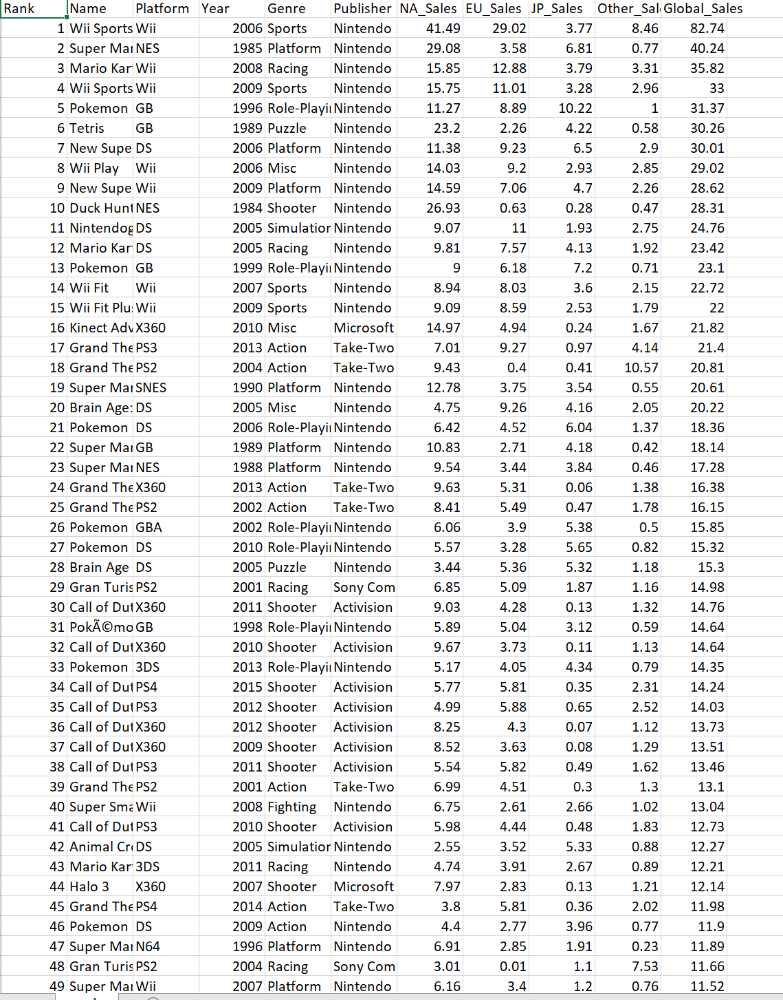
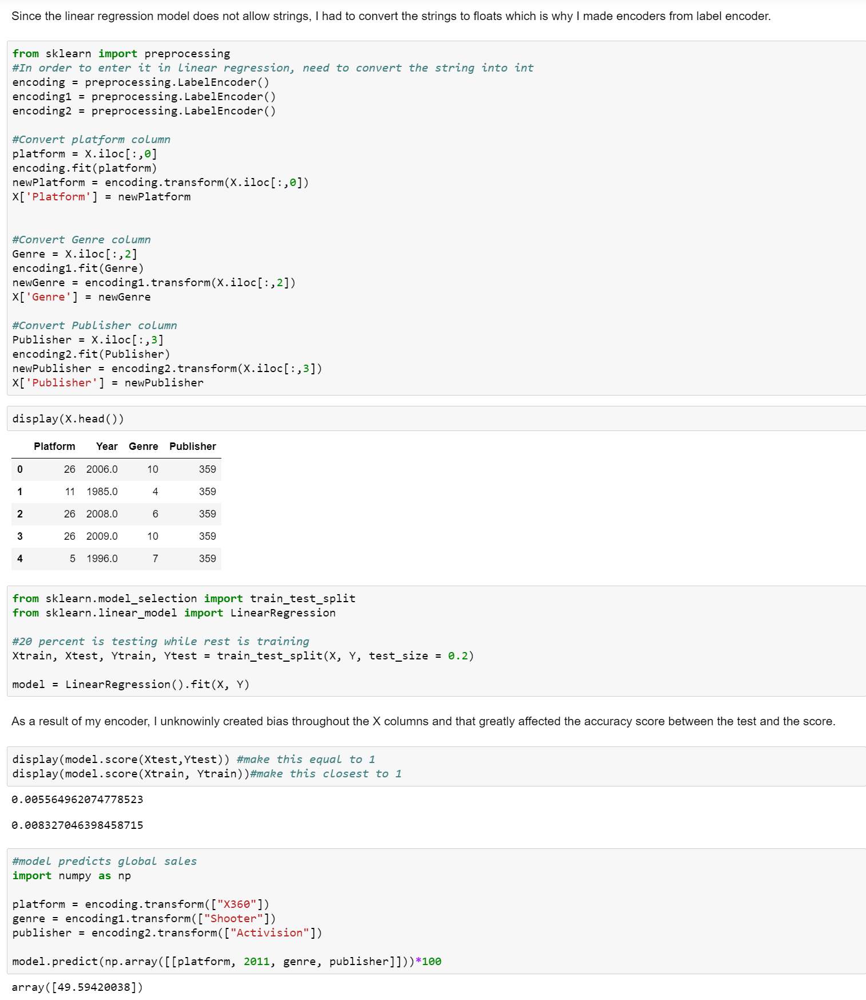
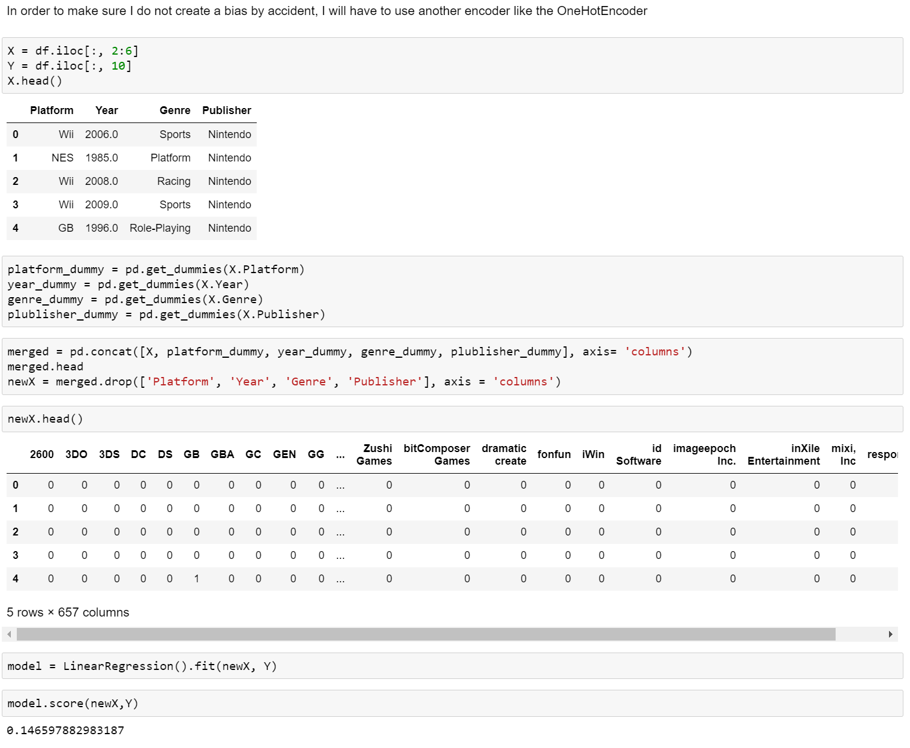
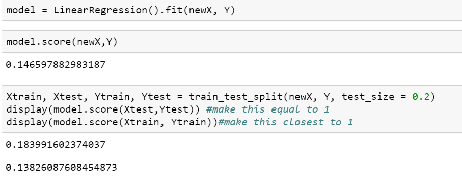
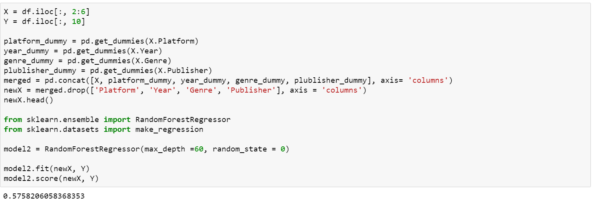
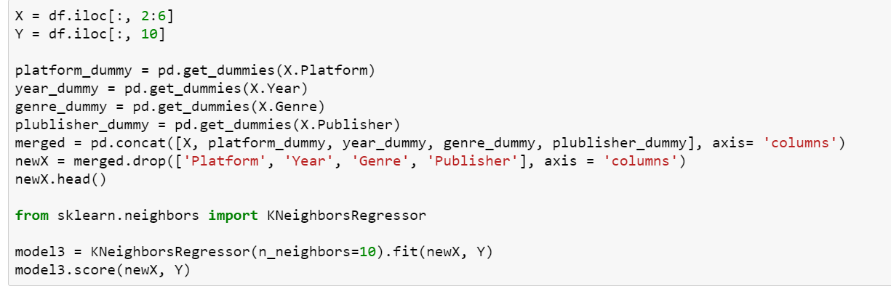
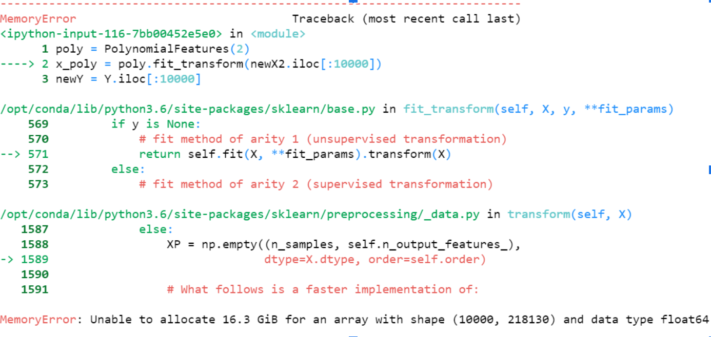
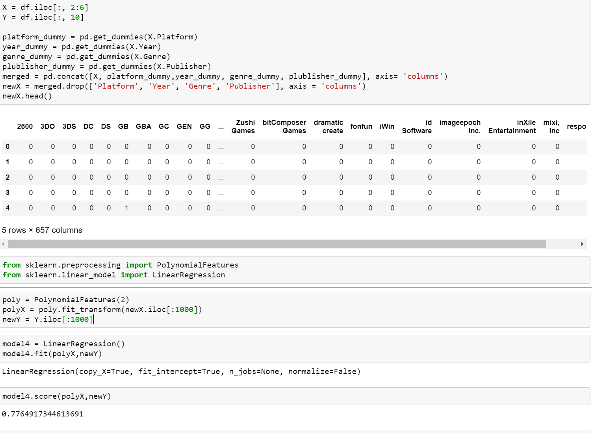

# VideoGameSales-Model

## Introduction
The reason I took this project was because I wanted to show off what I learned about machine learning and sklearn while showing my python skills. Even though I had a rough understanding of this course, I was still determined to prove my understanding which is the reason why I took this project by myself.

My project was about taking a data sheet about videogame sales and attempting to see whether it can predict the global sales of a new game. I would attempt to use regression models from sklearn in hopes of achieving a decent accuracy.
## Selection of Data
The source of this dataset was found in [kaggle](https://www.kaggle.com/gregorut/videogamesales) 

The data has over 16000 rows of videogames filled with 11 columns which contain the characistics of the games such as rank, name, platform, year, genre, publisher, NA_Sales, EU sales, JP_sales, Other_sales, Global_Sales. For the model I decided that I would focus on four columns that the model would train on which were name, platform, year, and genre. The information I would want the model to predict is the Global_Sales of the videogame. Even though there were other columns like rank, NA_Sales, and more, I felt like only training those 4 columns as I fear that too much data will hinder the model instead of making it better.
## Methods

The tools I used was:\
-NumPy\
-Pandas\
-Schkit-learn 

Within Sckit-learn:\
-LinearRegression\
-train_test_split\
-RandomForestRegressor\
-make_regression\
-LinearRegression\
-preprocessing
## Results
Within various regression models, I chose to highlight 4 models that I trained.\
One of the challenges I had to face was that for regression models, it required only ints and float in order to train it which was a problem since various values in my data were strings.\
The solution I came up with in order to solve this was to encode certian values in the columns in order to convert string to float values.The problem with this encoding is that I put a bias on the values I converted and it greatly affected my model in negative ways. Examples of this is by the score of the model and because of the bias, the accuracy was all over the place.\

In order to get rid of the problem I used pd.get_dummies on the columns that needed converting and as a result, it succesfully converts the columns with strings into floats of 0 and 1. Using that will get rid of any unneeded bias and allowed the model to train better with more accurate and controlled accuracy scores.

The first model I used was Linear Regression model which only brought 18% accuracy. 

The second model I used was Random Forst Regression which brought me to 57% accuracy.

The third model I used was KNeighbors Regression that made me have a negative 19% accuracy.

The fourth model I used was Linear Regression model but with Polynomial Features. The main problem with the Polynomial Features is that it would not run at all due to the memory problem of the model, this was due to the amount of columns the pandas.dummy caused. 

It only took in the first 1000 rows of the dataset and it had a success of 77%. Now while 77% was reliable, it came at the cost of cutting off majoirty of the data which was a problem.

## Discussion
Of couse I tested various other models in sklearn on the dataset but I decided to chose those 4 models to highlight my various results. Now judging the models, the accuracy was all over the place and the best model I got was the Random Forst Regression model with only a 57% accuracy. This was very dissapointing as 57% is an extremely unreliable score.

My initial plan on predicting global_sales with only 4 columns was proven not effective as I would have like to believe and this highlighted a severe problem with my models and the way I was utlizing them. In the future I would have adjusted the feature 4 columns I trained the data with and experiented on tesitng other columns like rank, JP_sales, etc. I am also interested in finding other data sets on Kaggle which follows the same theme as my original data set in hopes of finding more indiction on training a good model. 
## Summary
This project is focused on testing and learning new regression models which is something I have expereinced when creating these models. Despite that I still have a lot to learn as shown from my results as the best result I can get is a 77% accuracy for the first 1000 rows which is unreliable.

Even though my attempt of training a model with selected columsn failed to predict a value with high accuracy while utilizing the whole dataset, it taught me a lot about regression models and how I need to take a different approach on doing such as trying different model training library and different ideas.
## References
[kaggle](https://www.kaggle.com/gregorut/videogamesales) 
